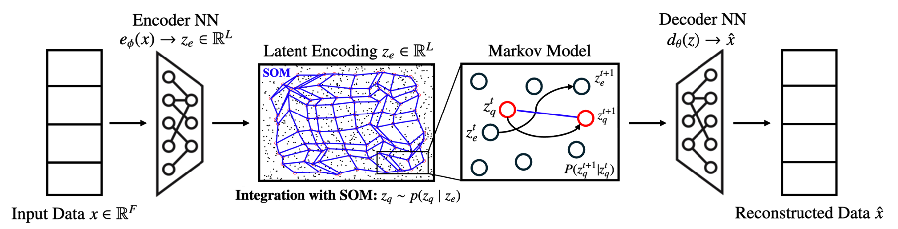

# Patient clustering with SOM-VAE
### Felix Steckenbiller & Paul Gramlich - Ludwig-Maximilians-Universität München

This project contains the application of a new approach (SOM-VAE) for patient clustering. In comparison, we use a baseline k-means and a more advanced deep probabilistic clustering model (DPSOM).

---

### Dataset 

#### `/Data/Preprocession/Data_Analysis.R`
In this file, the existing preprocessing of the casey_master.csv takes place. We additionally, analysed our LBP dataset using common summary statistics and plots, e.g. histograms, box plots, and missing value heat maps.

#### `/Data/Preprocession/Data_preprocessing.py`
We used a Low Back Pain (LBP) patient dataset, that was preprocessed to convert categorical variables into numerical values. 
Furthermore, NAs were removed and replaced with `0` and scaled the data from `[0,1]`.
Scaled and unscaled versions for plotting can be found in `/Data/LBP`.

#### `/Data/Preprocession/Data_processing.py`
Then the dataset was processed to fit the requirements of the models. 
The provided script is just an excerpt of the code that was then injected into the training files of the models.

### Models
Our main research focuses on SOM-VAE and is compared to a more advanced model (DPSOM) and 1 baseline model (k-means): 
* VAE-SOM (original model and paper: https://github.com/ratschlab/SOM-VAE) `/SOMVAE`
* DPSOM (original model and paper: https://github.com/ratschlab/dpsom) `/DPSOM`
* Baseline Model: K-MEANS++ `/KMEANS`

### Technical requirements
#### **DPSOM and KMEANS**: 
* Current Python version (3.12.X) and current installation of all packages that were used

#### **SOM-VAE**: 
* Python 3.6 with CUDA 9 and CuDNN 7.0.5 

*Installation of right CuDNN-version:*
* If needed: find installed CuDNN-version with `dpkg -l | grep cudnn` and deinstall with `dpkg --revome your-cudnn-version`
* Change directory: `cd /SOMVAE`
* Install CuDNN with `dkpg -i libcudnn7_7.0.5.15-1+cuda9.0_amd64.deb`
* Fix dependencies with `apt-get install -f`
  
*Packages:*
* Change directory: `cd /SOMVAE`
* Install packages with: `pip install -r requirements.txt`
* Install the package itself: `run pip install .`

### Run/Train the models
* SOM-VAE: `cd /SOMVAE/somvae` -> `python somvae_train.py`
* DPSOM: `cd /DPSOM/dpsom` -> `python DPSOM.py`
* KMEANS: `cd /KMEANS` -> `python kmeans.py`

## License
This project is licensed under the MIT License.
